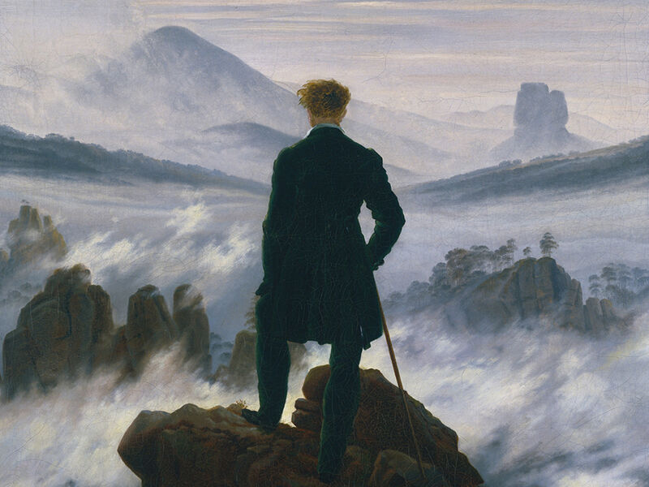

# Do Kim's User Page!

Hello, my name is Do Kim but I go by **James!**
Below is a little bit about myself made through `git`

I'm a third year CE Major in Warren!

I am proficient in these programming languages
- C++
- C
- Java

These are my goals for CSE 110 this quarter
[x] Create a User Page
[ ] Focus on the process rather than the grade in CSE 110
[ ] Work Hard, Have Fun!

Check out how to pass CSE 110 easily [here!](https://www.youtube.com/watch?v=dQw4w9WgXcQ)

These are my top 3 favorite movies!
1. Shawshank Redemption
2. August Rush
3. Dead Poet Society

This is my favorite quote from Shawshank
> I hope the Pacific is as blue as it has been in my dreams. **I hope.**"

And Below is my favorite painting,

Before you go I have [one more thing](./goodday.md) to say to you!

Wanna read [again?](#do-kims-user-page)